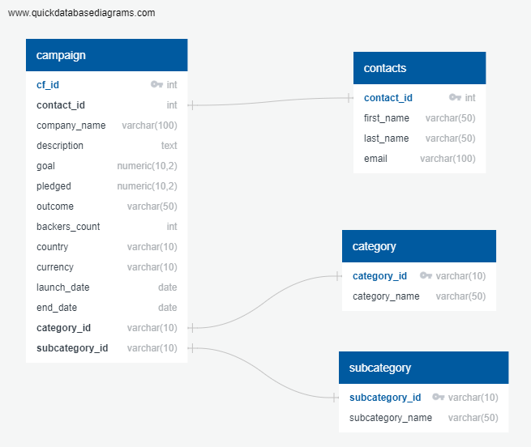
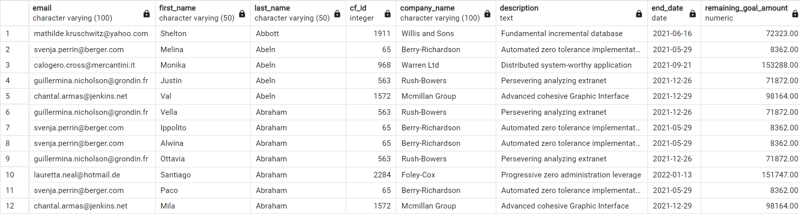

# Crowdfunding_DB

## Overview
The purpose of this assignment was to extract the data from the individual csv files into a database in Postgres. The files contained information on individual campains and their remaining amount. It also contained information on individual backers, which needed to be compiled

## Results

The data was restructured as follows to designate primary keys for each table and to make connections to the foreigns keys to connect the database.

The main processing that was necessary was to create a list of backers for all live campaigns with their emails. This is the resulting table in alphabetical order, which is stored under "email_backers_remaining_goal_amount.csv".

## Summary
The backers emails can be used to send out an alert that their crowdfunded campaign is still in need of funding. This can rally backers to either spread the word or donate to fully back a campaign. This can be further broken down in the future to calculate percentage breakdowns of remaining amount and be sent with visuals that display the amount left for the campaign.